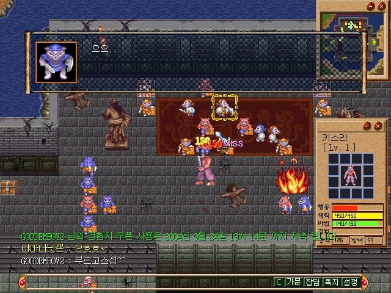
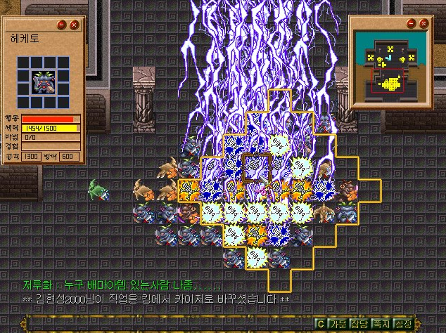

# 다크세이버 스크린샷 조사

## 저장된 원작 화면

### 다수 유닛 전투와 HUD

- 640×480, 한국어 클라이언트
- 중앙 전장과 우측 캐릭터 장비·상태 패널
- 우측 상단 미니맵, 하단 채팅·기능 메뉴
- 캐릭터와 용병 또는 적이 타일 단위로 배치됨
- 공격 피해, `MISS`, 화염 효과가 전장 위에 직접 표시됨

### 광역 번개 마법

- 634×474, 한국어 클라이언트
- 격자형 전장에서 대규모 광역 마법이 여러 타일을 덮음
- 좌측 캐릭터 상태·장비, 우측 미니맵 배치
- 플레이어/용병/몬스터가 한 전투에 대량으로 등장
- HUD는 금속·석재 질감의 프레임과 작은 픽셀 글꼴을 사용

## 중국판 아카이브

중국 시나게임에는 2000년 12월 15일 등록된 `黑暗之光` 스크린샷 9장의 목록이 남아 있다. 해상도는 약 640×480이며 각 파일은 101~172KB로 기록되어 있다. 현재 확인한 원본 GIF 주소 일부는 404를 반환하므로 이미지 자체는 저장하지 못했다.

- [시나게임 원작 스크린샷 아카이브](https://games.sina.com.cn/downgames/jietu/121596.shtml)
- [시나게임 원작 소개 및 스크린샷 메뉴](https://games.sina.com.cn/zhuanqu/darksaver/dark_intro.shtml)

## 식별 제외 대상

- 2014년 이후 중국 3D 웹게임 `黑暗之光`
- `Dark Light: Survivor`
- `Neo Darksaver`, `流星物語Online`, `라피스`
- 2025년 NUMINE이 발표한 동명 `DarkSaver`

위 자료는 명칭이 같거나 계보상 관련은 있지만 원작 닥세월드의 인게임 화면으로 분류하지 않았다.

## 권리 및 사용 주의

저장된 두 이미지는 연구·식별용 참고 자료이며, 원작 게임 그래픽과 웹 게시물 이미지의 재사용 권리는 확인되지 않았다. 프로젝트 배포물에 직접 포함하기 전 엠게임 및 해당 게시물 권리자의 허가 또는 별도 라이선스 확인이 필요하다.
